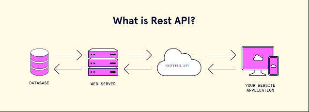
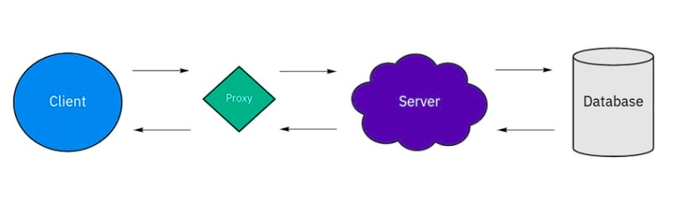

# REST O que é?
- REST foi criado em 2000 por Roy Fielding.
- REST (Representational State Transfer) é um estilo arquitetônico para fornecer padrões entre sistemas de computador na web.
- Ele facilita a comunicação entre os sistemas.
- Os sistemas compatíveis com REST geralmente são chamados de RESTful.

## Fundamentos REST
- Ele utiliza o protocolo HTTP como interface de comunicação para transferir dados através dos métodos HTTP, ou seja, utiliza manipulações de dados básicas como criar, atualizar, editar e excluir informações.
- REST nos ajuda a desenvolver serviços mais escaláveis, seguros e flexíveis. Para isso, a arquitetura REST possui 6 restrições:
  - Client-Server (Cliente-Servidor)
  - Stateless
  - Cache
  - Interface Uniforme (Interface uniforme)
  - Layered System (Sistema em camadas)
  - Code on demand (Código sob demanda)

### Client-Server
- O princípio fundamental da arquitetura Cliente-Servidor é a Separação de Preocupações.
- O cliente que envia a solicitação é completamente independente do servidor que retorna a resposta.

### Stateless
- Todas as informações exigidas em um pedido devem ser enviadas pelo cliente.
- O servidor não deve armazenar nenhum dado durante a comunicação Cliente-Servidor.
- Cada solicitação é uma solicitação independente.

### Cache
- Cache é uma estrutura de armazenamento computacional.
- É focado em manter armazenado os dados que são acessados frequentemente.
- Pelo CACHE é possível reduzir ou até mesmo eliminar a necessidade do cliente enviar solicitações ao servidor.

### Interface Uniforme
- É o contrato entre o cliente e o servidor que definem os padrões para a comunicação.

### Layered System
- Está relacionado ao fato de que pode haver mais componentes e subsistemas entre um cliente e um servidor. Por exemplo: Um cliente envia uma solicitação a um servidor, mas primeiro passa por uma camada chamada proxy para verificação de segurança.
  
  

### Code on demand
- Significa que um Servidor pode enviar um código executável como resposta ao cliente. 
- É o que acontece quando o navegador recebe uma resposta do servidor com uma tag HTML, para que, quando carregar o documento HTML ele possa executar o script.

## Request
- REST requer que o cliente faça uma solicitação ao servidor.
- Uma solicitação geralmente consiste em :
  - Verbo HTTP: Define o tipo de operação realizada. (Get, Post, Put, Delete)
  - Um header: Permite que o cliente repasse informações sobre a solicitação.
  - Um caminho para o recurso.
  - Um corpo de mensagem opcional contendo os dados. 

## Verbo HTTP (CRUD)
- GET: exibe um recurso específico (por ID) ou uma coleção de recursos já existentes.
- POST: cria um novo recurso.
- PUT: atualiza um recurso já existente (por ID).
- DELETE: remove um recurso (por ID).

## Código de resposta 
- As respostas do servidor contêm códigos de status para alertar ao cliente sobre informações de sucesso da operação.
- Alguns dos mais comuns códigos:
  - 200 (OK) 
  - 201 (Criado)
  - 204 (Sem conteúdo)
  - 400 (Pedido incorreto) - A solicitação não pode ser processada devido a uma sintaxe de solicitação incorreta.
  - 403 (Proibido)
  - 404 (Não encontrado)
  - 500 (Erro interno no servidor)

### Créditos
- [Codecademy](https://www.codecademy.com/article/what-is-rest)
- [Dev.to](https://dev.to/cassiocappellari/fundamentals-of-rest-api-2nag)

