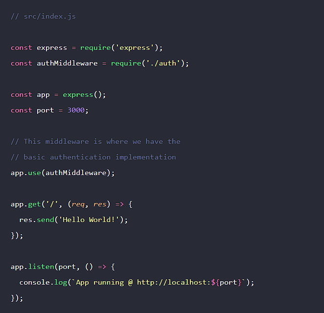
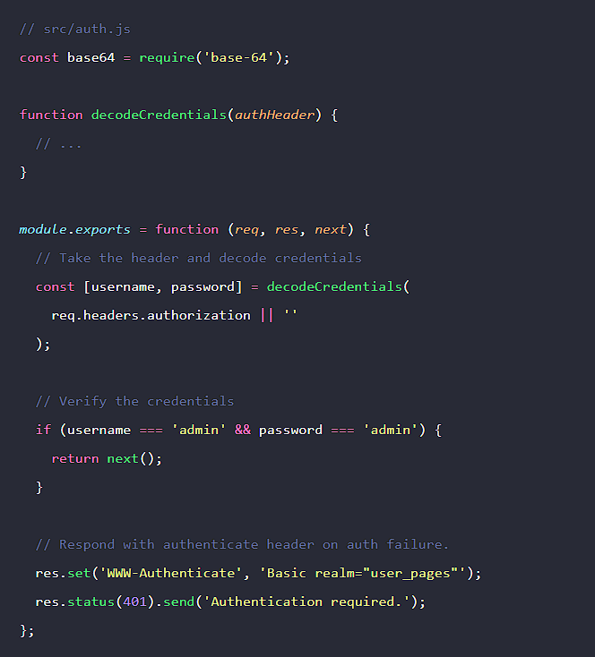

# Basic Auth (Autenticação Básica)

- Ela faz parte da especificação do HTTP.
- Todos os navegadores possuem suporte nativo para "Autenticação básica HTTP".

## Como funciona?

- É controlado pela resposta do servidor.
- Etapa 1:
  - Quando o navegador solicita o servidor pela primeira vez, o servidor verifica a disponibilidade do cabeçalho de autorização.
  - Por ser a primeira solicitação, nenhum cabeçalho de autorização é encontrado na solicitação.
  - Servidor responde com 401 Unauthorized.
  - Também envia o cabeçalho WWW-Authenticate com o valor definido como basic.
    ```
    401 Unauthorized
    WWW-Authenticate: Basic realm='user_pages'
    ```

- Etapa 2:
  - Navegador recebe a resposta do servidor.
  - O navegador nota o cabeçalho WWW-Authenticate e mostra o pop-up de autenticação.

- Etapa 3:
  - Após o usuário enviar suas credenciais por meio do pop-up.
  - O navegador codificará automaticamente as credenciais usando a base64.
  - Enviará o cabeçalho de autorização na mesma solicitação.

- Etapa 4:
  - O servidor irá decodificar e verificar as credenciais.
  - Se as credenciais forem válidas, enviará a resposta ao cliente.

## Basic Auth em node

### É assim que implementamos Basic auth no nosso NodeJS.

<div>
    
    <p>Parte 1: introduzindo no nosso arquivo index</p>
    
    <p>Parte 2: arquivo de configuração da nossa autenticação básica</p>
</div>
