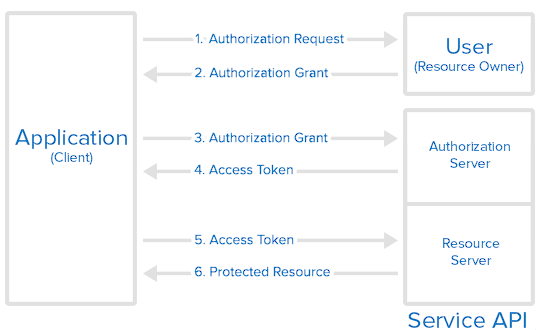

# OAuth (Open Authorization) - OAuth 2.0
  - É uma estrutura de autorização.
  - Permite que aplicatibos como facebook, github... Obtenham acesso limitado a contas de usuário em um serviço HTTP.
  - Fornece fluxo de autorização para aplicativos web ou desktops, como também móveis.
  
## Funções OAuth
  - ***Proprietário do recurso***: O proprietário é o usuário que autoriza um aplicativo a ter acessar conta.
  - ***Cliente***: O cliente é a aplicação que deseja acessar a conta do usuário. Antes disso ser feito, precisamos da autorização do cliente e deve ser validada pelo sistema de api.
  - ***Servidor de recursos***: O servidor de recursos hospedas as contas de usuários protegidas. 
  - ***Servidor de autorização***: Veirifica a indentidade do usuário e emite tokens de acesso ao aplicativo.
````
  A API de um serviço cumpre as funções de recurso e de servidor de autorização. Referimos a essas duas funções combinadas como Serviço ou API.
````

## Representação Gráfica

  
  1. O aplicativo solicita autorização para acessar os recursos de serviço do usuário.  
  2. O aplicativo recebe uma concenção de autorização caso o usuário autorize.
  3. O aplicativo solicita um token de acesso do servidor de autorização (API) apresentando uma indentificação da sua própria identidade.
  4. Se a indentidade do aplicativo for autenticada e a concenssão de autorização for válida, a API emitira um token de acesso ao aplicativo. A autorização está concluída.
  5. A aplicação solicita recursos da API e apresenta o token de acesso para autenticação.
  6. Se o token for válido a API entrega os recursos solicitados ao aplicativo.


## Para se aprofundar mais no assunto:
  - OKTA: https://developer.okta.com/blog/2017/06/21/what-the-heck-is-oauth