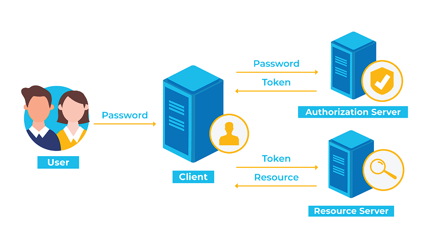

# Token Auth  
  - É um protocolo que permite aos usuários verificar sua identidade.
  - Após a verificação, recebem um token exclusivo.
  - Para que não precisem ficar preenchendo suas credenciais todas as vezes que visitarem o site, o token durante sua vida facilita esse acesso.
  - A autenticação baseada em token é diferente das técnicas tradicionais de autenticação baseadas em senhas ou servidor.
  - O token oferece uma segunda camada de segurança onde os admin têm controles sobre cada ação e transação.
  
## 3 Tipos de token Auth
  - ***Connected:*** Chaves, discos, unidades e outros itens físicos são conectados ao sistema para o acesso. Exemplo de token conectado: dispositivo USB, uso de cartão inteligente para fazer login em um sistema.
  - ***Contactless:*** Um dispositivo está próximo o suficiente de um servidor para se comunicar com ele, mas não se conecta. O conhecido "Magic Ring" da Microsoft seria um exemplo desse tipo de token.
  - ***Disconnected:*** Um dispositivo pode se comunicar com um servidor por longas distâncias, mesmo que nunca toque outro dispositivo. O exemplo seria utilizar o telefone para um processo de autenticação de dois fatores.

## Autenticação de token em etapas
  - ***Solicitação:*** A pessoa solicita o acesso a um servidor ou recurso protegido. Isso pode envolver login, por exemplo.
  - ***Verificação:*** O servidor determina que a pessoa deve ter acesso, após verificar os dados enviados pela pessoa.
  - ***Tokens:*** O servidor se comunica com o dispositivo de autenticação. Após a verificação, o servidor emite um token e o repassa ao usuário.
  - ***Armazenamento:*** O token fica no navegador do usuário.



```
JSON WEB TOKEN(JWT) é uma forma especial de token de autenticação
```


## Créditos
  - okta: https://www.okta.com/identity-101/what-is-token-based-authentication/