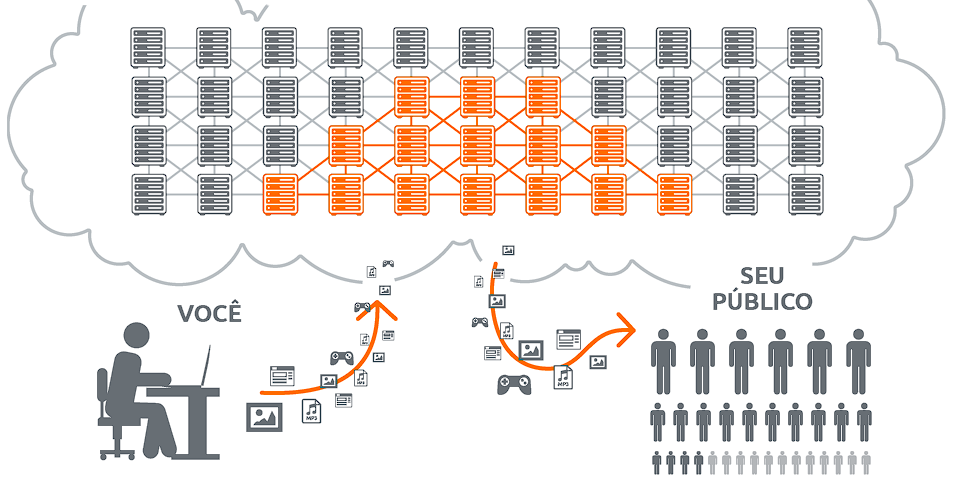

# Cloud Computing 
  - É uma tecnologia que permite que as empresas acessem recursos de tecnologia da informação.
  - Sua vantagem é que em vez de investir em equipamentos próprios, a nuvem permite acesso a esses recursos de forma dinâmica e sob demanda.
  - As empresas não têm preocupação com manutenção e atualização de equipamentos.
  - Serviços de nuvem costumam investir em tecnologias de segurança avançada para proteger os dados do cliente.

  

## Como funciona a Cloud 
  - É composta por uma série de servidores interligados que oferecem armazenamento e processamento de dados.
  - Você ajusta os recursos destes servidores de acordo com suas necessidades.
  - A nuvem permite que você ajuste seus recursos a qualquer momento, conforme suas necessidades mudam.

## Tipos de Cloud
  - Nuvem Pública
  - Nuvem Privada
  - Nuvem Híbrida
  - Multicloud

### Nuvem Pública
  - Geralmente criadas em uma infraestrutura de TI que não é propriedade do usuário final.
  - Os provedores oferecem serviços nos data centers on-premise dos clientes.
  - Todas as nuvens se tornam públicas quando os ambientes são repartidos e redistribuídos para vários locatários.

### Nuvem Privada
  - São ambientes de nuvem dedicados ao usuário final.
  - O ambiente geralmente é executado atrás do firewall desse usuário.
  - Todas as nuvens se tornam privadas quando:
    - A infraestrutura de TI subjacente é dedicada.
    - O cliente tem acesso totalmente isolado a ela.

### Nuvem Híbrida
  - É um ambiente de TI aparentemente único.
  - Criado a partir de outros ambientes conectados por:
    - LANs (redes locais).
    - WANs (Redes de área ampla).
    - VPNs (Redes privadas virtuais).
    - APIs.
  - Todo sistema de TI se torna Híbrido quando a aplicação pode se mover por vários ambientes diferentes, mas conectados entre si.
  - Todos esses ambientes precisam ser gerenciados como um só, por meio de plataforma integrada de gerenciamento e orquestração.

### Multicloud
  - É composta por mais de um serviço e de um fornecedor de nuvem, pública ou privada.
  - Todas as nuvens Híbridas são multiclouds.
  - Nem todas as nuvens multiclouds são Híbridas.
  - Multiclouds se tornam Híbridas quando conectadas a alguma plataforma de integração e orquestração.
  - Ter várias nuvens está se tornando mais comum entre empresas que buscam melhorar a segurança.  

## Alguns dos maiores Provedores Cloud
  - AWS (Amazon Web Service)
  - Microsoft Azure
  - Google Cloud
  - IBM Cloud

## Créditos
  - [Mandic](https://www.mandic.com.br/cloud/#:~:text=A%20cloud%20computing%20ou%20simplesmente,e%20aplica%C3%A7%C3%B5es%2C%20atrav%C3%A9s%20da%20internet)
  
  - [RedHat](https://www.redhat.com/pt-br/topics/cloud-computing/public-cloud-vs-private-cloud-and-hybrid-cloud)