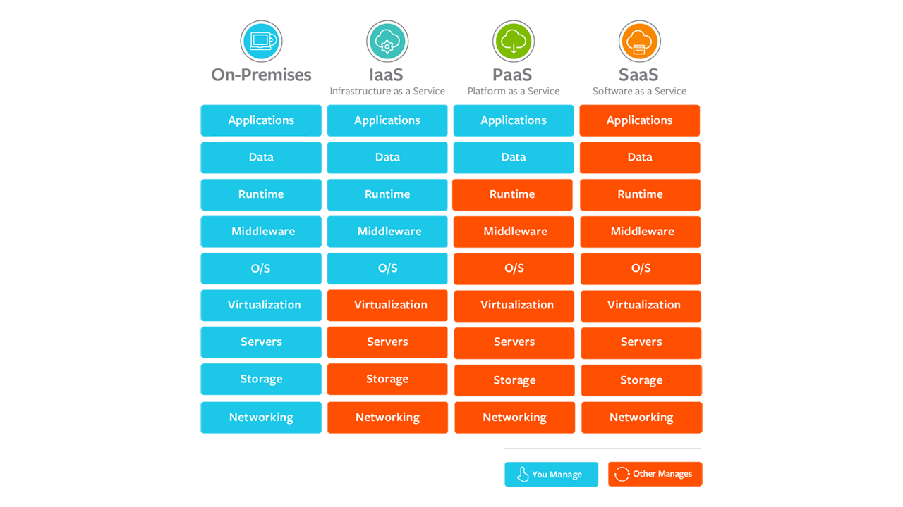

# Serviços em Nuvem
  - É uma infraestrutura, plataforma ou software hospedados por fornecedores e disponibilizados aos usuários via internet.
  - Há 3 tipos principais de modelos de serviços de nuvem: 
    - IaaS  
    - PaaS
    - SaaS

## IaaS (Infraestrutura como serviço)
  - O provedor de serviços IaaS gerencia uma infraestrutura para você (Servidores reais, rede, virtualização e armazenamento de dados).
  - O usuário pode acessá-la por meio de uma API ou por um painel de controle.
  - O usuário gerencia componentes como sistema operacional, aplicações e middleware.
  - O fornecedor fornece o hardware, a rede, os discos rígidos, o armazenamento e os servidores.
  - O fornecedor é responsável por corrigir interrupções, fazer reparos e solucionar problemas de hardware.

## PaaS (Plataforma como Serviço)
  - O hardware e uma plataforma de aplicações são gerenciados pelo provedor.
  - O usuário é responsável por cuidar das aplicações executadas na plataforma e dos dados que eles dependem.
  - Principalmente para desenvolvedores e programadores, PaaS fornece aos usuários uma plataforma compartilhada para o desenvolvimento e gerenciamento de aplicações sem que eles precisem criar e fazer manutenções da infraestrutura.

## SaaS (Plataforma como Serviço)
  - Um serviço que entrega aos usuários uma aplicação gerenciada pelo provedor.
  - Normalmente, são aplicações da Web ou Mobile.
  - Atualizações, correções de bug e outras tarefas gerenciais de manutenção de software são realizados pelo usuário.
  - Se conectam por aplicações em nuvem por meio de um painel de controle ou API.
  - SaaS também elimina a necessidade de instalar a aplicação localmente, permitindo adotar métodos de acesso coletivo ao software.

