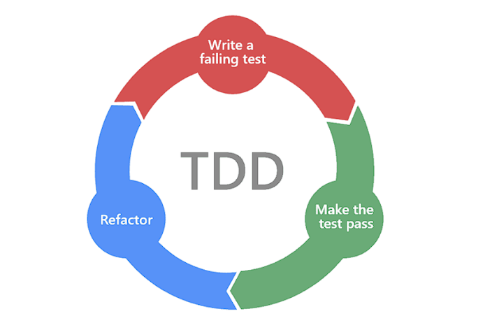

# Unit Testing
- São testes onde unidades individuais (Módulos, funções/métodos, rotinas, etc.) são testadas para garantir sua correção.
- Esses testes de baixo nível garantem que os componentes menores sejam funcionalmente corretos.
- Geralmente esses testes são escritos durante o desenvolvimento e são executados como testes automatizados.

## Test Doubles
- Termo para qualquer caso em que você queira substituir um objeto de produção para fins de teste.
- Conhecido como "mockar", o mock é apenas um dos tipos de test doubles.
- Além do mock, temos Dummies, Fakes, Spies e Stubs.

## Dummies, Fakes, Spies, Stubs e Mocks

### Dummies 
- São objetos ou dados fictícios que substituem dados reais.
- São usados para satisfazer parâmetros.
- Com o uso deles, é possível diminuir a complexidade dos testes, focando no que importa.

### Fakes  
- São objetos reais que implementam um comportamento que torna inviável para serem utilizados em produção.
- Exemplo: In-Memory Database.

### Spies
- Podem ser usados para dizer se um método específico e importante no escopo da função que está sendo testada foi chamado, quantas vezes, com quais argumentos, etc.

### Stubs
- São semelhantes aos spies, porém, eles conseguem substituir toda a implementação de um método específico.
- São úteis para simular uma possível exceção.
- Evitam estresse na camada de serviço:
  - Evitando gravar um registro no banco de dados.
  - Chamada à uma API ou integração a outros serviços, possibilitando a diminuição no tempo de execução do teste.

### Mocks
- É a camada mais alta para tornar um comportamento falso.
- Geralmente são usados para emular um banco de dados, um output de dados ou até mesmo uma dependência.
- A diferença para o stub é que no mock é possível testar diversas ramificações do seu código, já que no mock é possível testar diversos comportamentos de uma só vez.

## TDD (Test Driven Development)
- É um método muito comum para construção de testes.

### RED
- Escreva um teste que irá falhar.
- Pense em como você teria um teste caso o seu código estivesse implementado.

### GREEN
- Implemente um código que satisfaça as condições do seu teste.
- O intuito aqui é que o código implementado faça com que o teste criado no ciclo anterior passe.

### REFACTOR
- Nesse ciclo devemos focar em melhorar os pontos que não eram uma preocupação:
  - Legibilidade
  - Reuso
  - Duplicidade
- Objetivo de deixar o código mais funcional e mais limpo.
